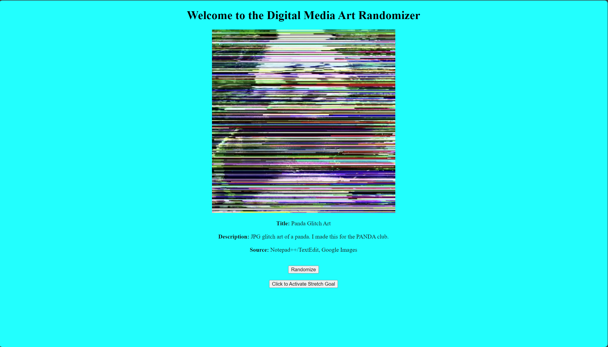
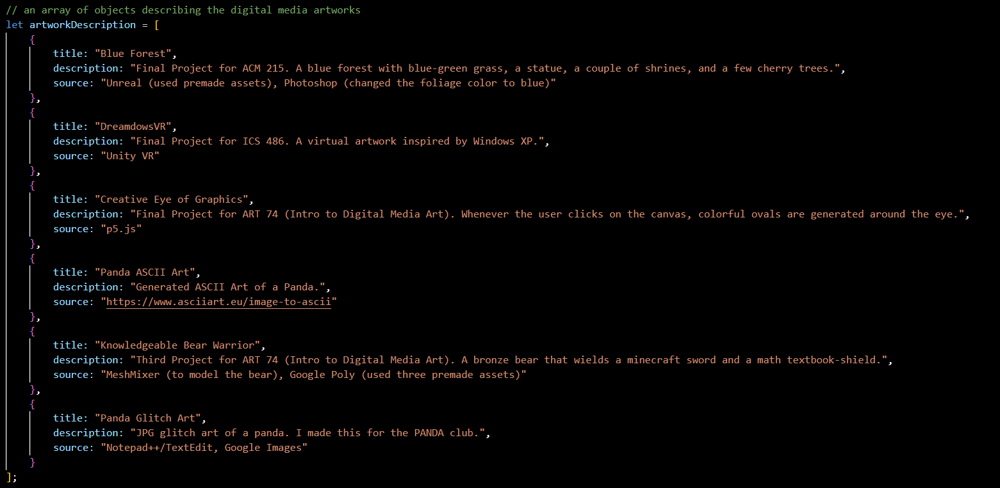

# Digital-Media-Art-Randomizer
 
 

For this project, you'll be coding a digital media art randomizer.  When you click on the randomize button, a random digital media artwork displays on the web page and its brief information.  For my examples, I chose panda glitch art, panda ASCII art, a 3D model of a bronze bear, a blue forest, a creative coding sketch of an eye, and DreamdowsVR.  You can use whatever images or gifs as long as it's related to digital art. 

## Objectives

Use **JavaScript** to display text and manipulate elements on webpages.  Use the DOM to have JavaScript communicate with HTML/CSS to change the image and text with a click of a button.    
  1. Create a gallery of digital media artworks
  2. Provide a title, description, and source for each digital media artwork
  3. Implement code for randomizer

## Difficulty

Intermediate

## Prerequisites

  + Arrays
  + Functions
  + Objects
  + Basic understanding of Document Object Model (DOM)
    + document.getElementById()
    + innerHTML
    + img.src
    + style.display 

## Your Challenge

### Part 1: Setup

Make sure to have the following files:
  + index.html
  + style.css
  
Create the following files:
  + script.js
  + folder called "assets"
    + 6 images (or gifs) related to digital art   

You can use the images I provided, use your own, or use existing ones on the Internet.  No need to change ```index.html``` if you use the provided images.

If you choose not to use the ones provided, then you can use digital fan art, image edits, 3D models, game sprites, Minecraft builds, or anything relating to digital art.  The possibilities are endless.  Oh and make sure to change the image source in ```index.html```, otherwise, you'll see the panda glitch art upon start (unless you don't mind).

If you choose to use your own digital media artwork, then briefly state how you made it instead of providing the source link.

### Part 2A: Creating Variables in JavaScript File (script.js) 

  1. link script.js to index.html at the end of the ```<body>``` tag
  2. create two variables that store document.getElementById()
      + first variable is called ```artwork``` and stores an id called ```dma```
      + second variable is called ```desc``` and stores an id called ```info```
      + don't forget the quotation marks around the id name 
  3. create an int variable ```randomInt``` that stores ```0```
  4. create an array called ```artworks``` that stores 6 string values
      + each string should start with ```assets/``` and end with ```file name``` and ```file extension```
      + e.g. ```"assets/panda-glitch-art.webp"``` 
     
### Part 2B: Creating an Array of Objects

  1. create an array of objects called ```artworkDescription```
  2. store 6 objects in the array
      + each object should contain ```title```, ```description```, and ```source```
        + title should be the name of the digital artwork
        + provide a brief description of the digital artwork
        + provide software tools used if you made the digital artwork
        + provide the URL link to the digital artwork if you didn't make it   

  Your array of objects should look something like this...

   
  
  **Make sure the titles, descriptions, and sources are appropriate to the digital artworks you've chosen.** 
  
  ### Part 3A: Template Literals (Multi-line Strings and String Interpolation)

  Before we implement the object properties into innerHTML, let me introduce you to template literals.  Template literals will come in handy because you get to display multiple lines of text in a paragraph element.  Also, it's more convenient than string concatenation as it usually requires less space.

  To make a multi-line string, type in the **`** key located between the ```esc``` key and the ```tab``` key.  You can type in whatever you want, but to make it multi-lined, you must press ```enter``` when you want to type more stuff on the next line.

  Here's an example of a multi-line string:
  ```js
  var multiLine = `Information and Computer Sciences
                   Creative Computational Media
                   School of Cinematic Arts`;

  console.log(multiLine);
  // Information and Computer Sciences
  // Creative Computational Media
  // School of Cinematic Arts
  ```
  This is equivalent to using three print statements to print multiple strings but uses fewer lines of code. 

  To perform string interpolation, you would put the variable inside of curly brackets right after the dollar sign.  It must be inside of the backticks, otherwise it won't work.  Here's how to code string interpolation:
  ```js
  var interpolateIO = `1 means ${true} or ON, 0 means ${false} or OFF`;
  var interpolateCattle = `There are ${4} kinds of farm animals in Minecraft.`;

  let virtues = ["Power", "Courage", "Wisdom"];

  var interpolateTri = `The three virtues:
                         - ${virtues[0]}
                         - ${virtues[1]}
                         - ${virtues[2]}`;

  console.log(interpolateIO);
  // 1 means true or ON, 0 means false or OFF

  console.log(interpolateCattle);
  // There are 4 kinds of farm animals in Minecraft.

  console.log(interpolateTri);
  // The three virtues:
  //  - Power
  //  - Courage
  //  - Wisdom
  ```
  Here's the link if you'd like to learn more about template literals:
  https://developer.mozilla.org/en-US/docs/Web/JavaScript/Reference/Template_literals

  Now that you know how to do multiline strings and string interpolation, let's apply that to innerHTML.  The paragraph tag with an id called "info" currently displays "Hello World".  Let's change "Hello World" to the digital artwork's title, description, and source.  We would need to use a DOM variable we created earlier called ```desc```.  The innerHTML property should let us modify what's in the paragraph element.

  1. type in ```desc.innerHTML``` and assign it with a template literal

  This is the part where we type in HTML tags to improve the layout of the paragraph.  We want to make the information more readable by increasing the line spacing with ```<br>``` and bolding the property names with ```<b>```.  We also want to use string interpolation to get the properties of each object in the array.  

  2. type in 3 lines in the template string
      + The first line should have ```Title:``` in between the ```<b>``` tag followed by ```${artworkDescription[any number from 0 to 5].title}<br><br>```
      + The second line should have ```Description:``` in between the ```<b>``` tag followed by ```${artworkDescription[any number from 0 to 5].description}<br><br>```
      + The third line should have ```Source:``` in between the ```<b>``` tag followed by ```${artworkDescription[any number from 0 to 5].source}<br><br>```
    
     **Make sure the index you used for your array of objects is the SAME, otherwise, you'll display information from different digital artworks.**

### Part 3B: Create Randomizer Function

You're almost done with this project.  Things look visually complete, but the functionality to randomize digital media artworks is missing.  I already put the function name for the button's onclick event in the HTML file.  So all that's left is to create a function for it.

   1. create a function called ```changeArtwork```
   2. inside of the function, implement the following code snippet
   ```js
   // need floor function to "convert" float to int
   // multiplied by artworks.length to make the range go from 0 to artworks.length - 1
   randomInt = Math.floor(Math.random() * artworks.length);
   ```
   Link to learn Math.random(): https://www.w3schools.com/JS/js_random.asp
   
   3. assign the artworks array with randomInt as the index to the image source of ```artwork``` 
   4. Repeat step 2 from part 3A except change the array of objects' indexes to randomInt

   After step 4, your digital media art randomizer should work.  If it doesn't work, then you try to see if you did all the steps correctly, or you can ask the mentors for help.

   Congratulations!

   You just learned how to make a randomizer for digital media artworks.  Now people can see digital artworks either you or someone else made.  They can see other types of digital media art out there, including ones you don't see around in school as much.  If you plan to go to UH Manoa and you're interested in both coding and digital art, then consider checking out the creative computational media certificate.

## Stretch Goals

So you decided to continue working more on this project to add it to your project portfolio? Luckily, I also provided the HTML and CSS code for the stretch goal.  I'll give you a few more ideas of what to add, but first, let's have the user hide/unhide the net art demo with a click of a button.

### Bonus Part 1: Creating another DOM variable

   1. Create a variable called ```div``` that stores document.getElementById()
      + The id should be "hide"
   2. Call ```style.display``` on ```div``` and assign it with "none"
      + This is used, so the user doesn't have to click on the second button twice upon start
   
### Bonus Part 2: Creating a function that hides/unhides the div

   1. Create a function called ```showDiv```
   2. Create an if/else statement that checks if the div's style display is none (hint: use ===)
   3. In the if block, set the div's style display to "block"
   4. In the else block, set the div's style display to "none"

   Alternatively, you can skip step 2 of bonus part 1, and then inside the if condition, add ```div.style.display === ''``` after the OR logical operator.

   After step 4, you should be able to hide/unhide the net art demo.  You can watch the videos to see what net art is like.  Feel free to explore more examples of creating websites as an art medium by clicking on the red image below.

### More stretch goals?

Now that you implemented the JS code for the stretch goal, you're free to modify the videos and image link to a different digital media art demo.  They can be demos of either your or someone else's game project.  They can also be video game trailers, 3D modeling tutorials, or your favorite digital art tutorials.

You can also stylize the webpage with CSS.  For example, change the background color, change the font and its color, decorate the buttons, etc.  Add more digital media artworks to your randomizer.  Apply it to creative coding (p5js for example), Scratch, or game development (Unity or Godot for example).
   
